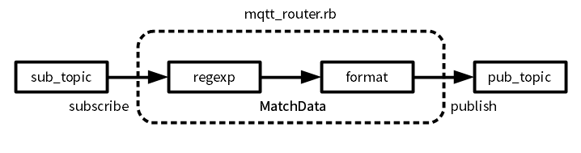

mqtt_router.rb
====
simple mqtt message routing program.

Usage
----
    
    $ gem install mqtt
    $ git clone https://github.com/yoggy/mqtt_router.git
    $ cd mqtt_router
    $ cp config.yaml.sample config.yaml
    $ vi config.yaml
    
        mqtt_host:     iot.eclipse.org
        mqtt_port:     1883
        mqtt_use_auth: false
        mqtt_username: username
        mqtt_password: password
        mqtt_subscribe_topic: subscribe_topic
        mqtt_subscribe_regexp: co2\":(.+),
        mqtt_publish_topic: publish_topic
        mqtt_publish_format: segd#{sprintf("%04d",md[1].to_i)}
    
    $ ./mqtt_router config.yaml'
    
Dataflow
----

Copyright and license
----
Copyright (c) 2016 yoggy

Released under the [MIT license](LICENSE.txt)
